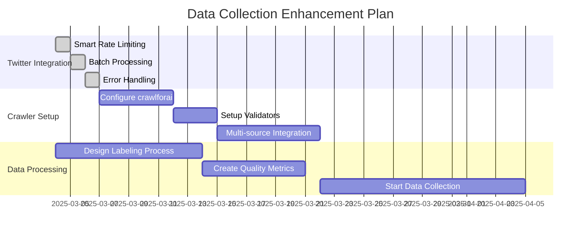
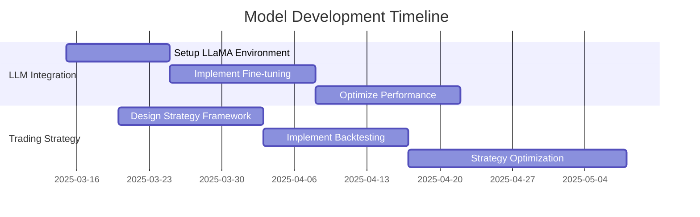

# Active Context

## Current Focus
Building a high-accuracy financial KOL sentiment dataset and trading strategy model with LLM integration.

## Recent Progress
- Enhanced Twitter data collection with smart rate limiting
- Implemented batch processing for optimal API usage
- Improved error handling and quota management
- Data storage and logging systems established

## Active Work Streams

### 1. Data Collection Enhancement

### 2. Model Development Pipeline

## Current Challenges

### 1. Data Collection
- Optimize multi-source data collection
- Configure crawlforai for financial data sources
- Set up data validation and quality metrics
- Monitor and adjust rate limit strategies

### 2. Sentiment Analysis
- Developing accurate labeling methodology
- Ensuring consistent labeling across team
- Handling market-specific terminology

### 3. Model Development
- LLaMA integration and optimization
- Efficient fine-tuning process
- Strategy validation methodology

## Next Steps

### Immediate Priorities
1. Design and implement KOL identification system
2. Develop sentiment labeling methodology
3. Set up LLaMA fine-tuning infrastructure
4. Create initial trading strategy framework

### Technical Tasks
- [x] Basic Twitter scraping
- [x] Data processing pipeline
- [x] NER implementation
- [ ] SeekingAlpha integration
- [ ] Sentiment labeling interface
- [ ] LLaMA model setup
- [ ] Trading strategy backtesting

## Key Decisions

### Architecture
- Using modular design for easy component updates
- Implementing robust logging for debugging
- Setting up scalable data storage

### Methodology
- Focus on high-influence KOLs for quality data
- Rigorous sentiment labeling process
- Multi-factor trading strategy approach

### Tools & Technologies
- crawlforai for multi-source data collection
- LLaMA for sentiment analysis
- Python-based trading framework

## Risk Monitoring

### Technical Risks
- Crawler maintenance and updates
- Data quality consistency
- Model performance stability

### Project Risks
- Data collection timeline
- Labeling accuracy
- Strategy validation period

## Upcoming Milestones
1. Complete KOL identification system
2. Establish labeling methodology
3. Initial LLM fine-tuning
4. Basic trading strategy implementation
