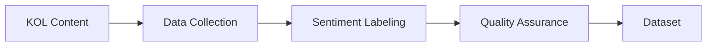
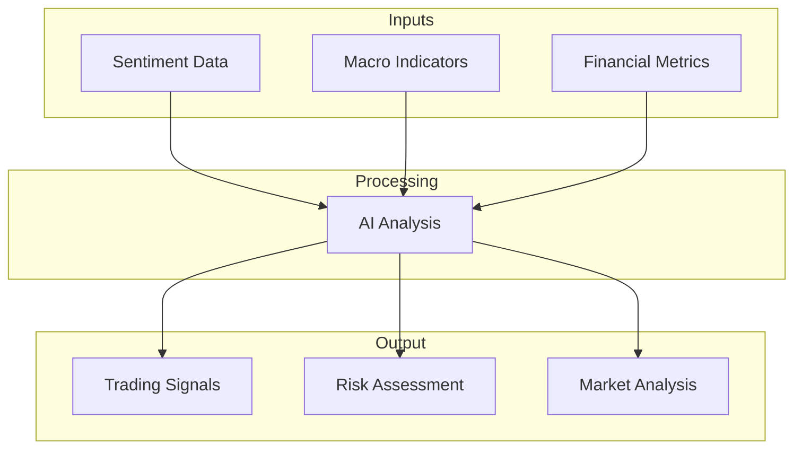
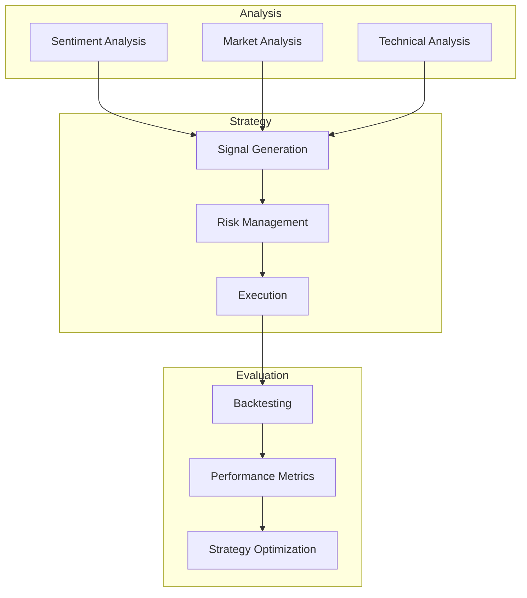

# Product Context

## Problem Statement
The financial markets are heavily influenced by KOL (Key Opinion Leader) sentiments, but existing sentiment analysis tools often fail to:
1. Accurately capture the nuanced opinions of influential market voices
2. Integrate sentiment data with traditional market indicators
3. Translate sentiment analysis into actionable trading strategies

## Solution Overview
PIRAS (Predictive Investment Research and Analysis System) bridges these gaps by:

### 1. High-Quality Sentiment Dataset

- Focus on influential financial voices
- Rigorous labeling methodology
- Context-aware sentiment analysis
- Quality verification process

### 2. Integrated Market Analysis

### 3. Trading Strategy Framework

## User Experience Goals

### 1. Data Collection & Labeling
- Automated content gathering from multiple sources
- Intuitive labeling interface for analysts
- Real-time quality metrics
- Version control for datasets

### 2. Model Training & Tuning
- Clear model performance metrics
- Automated training pipelines
- Easy parameter adjustment
- Model comparison tools

### 3. Strategy Development
- Interactive strategy builder
- Real-time performance monitoring
- Risk management controls
- Strategy backtesting interface

## Success Criteria

### 1. Dataset Quality
- Labeling accuracy > 90%
- Coverage of key market events
- Regular dataset updates
- Diverse KOL representation

### 2. Model Performance
- Sentiment prediction accuracy
- Processing speed
- Adaptation to market changes
- Resource efficiency

### 3. Trading Strategy
- Risk-adjusted returns
- Maximum drawdown limits
- Strategy robustness
- Real-world applicability

## Stakeholder Requirements

### Data Scientists
- Clean, well-structured data
- Comprehensive documentation
- Efficient training infrastructure
- Performance analysis tools

### Financial Analysts
- Intuitive interface
- Real-time insights
- Custom analysis capabilities
- Export functionality

### Risk Managers
- Risk metrics dashboard
- Alert systems
- Position monitoring
- Compliance tools

## Future Enhancements

### Phase 1: Core Functionality
- Basic sentiment analysis
- Initial strategy framework
- Essential monitoring tools

### Phase 2: Advanced Features
- Multi-model ensemble
- Advanced risk analytics
- Strategy optimization tools

### Phase 3: Production Scaling
- Real-time processing
- Advanced automation
- Enterprise integration
