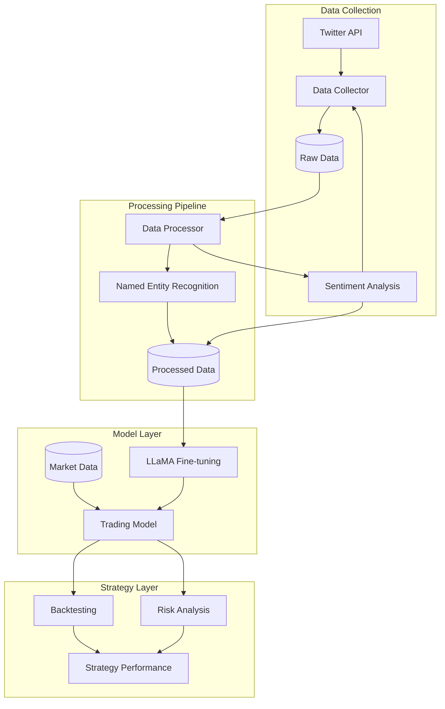
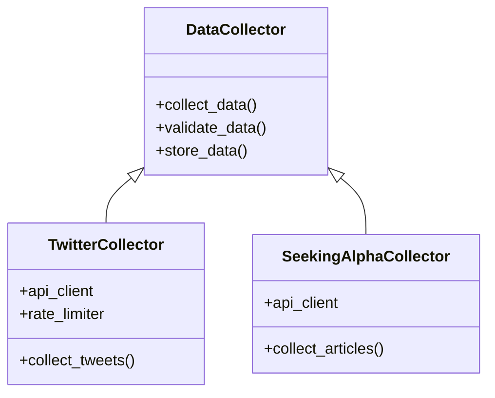
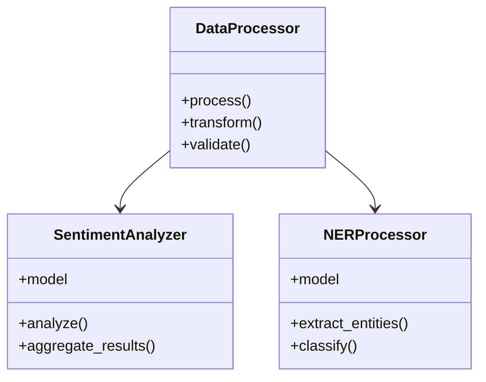
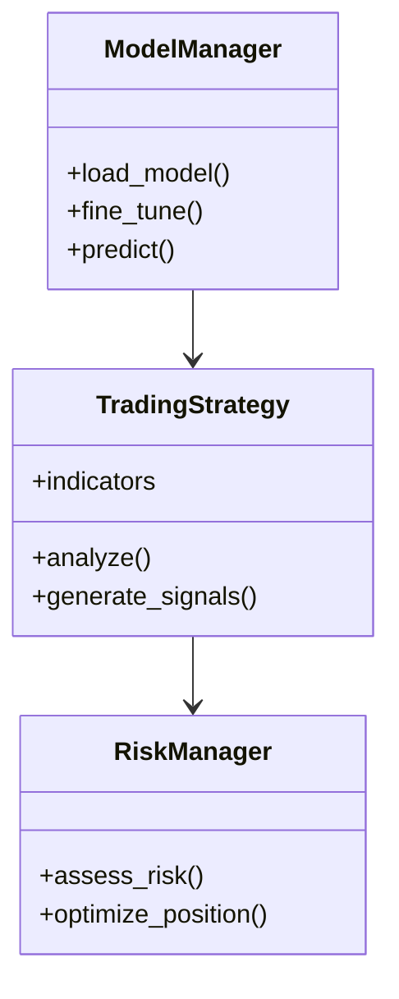

# System Patterns

## Architecture Overview

## Design Patterns

### 1. Data Collection Pattern

### 2. Processing Pipeline Pattern

### 3. Model Integration Pattern

## Key Components

### 1. Data Pipeline
- Modular data collectors
- Robust error handling
- Rate limiting management
- Data validation layers

### 2. Processing System
- Pipeline architecture
- Parallel processing capabilities
- Extensible transformation framework
- Quality assurance checks

### 3. Model Framework
- Model versioning
- Training pipeline
- Inference optimization
- Performance monitoring

### 4. Trading System
- Signal generation
- Risk management
- Position sizing
- Performance tracking

## Design Principles

1. **Modularity**
   - Independent components
   - Clear interfaces
   - Pluggable architecture

2. **Scalability**
   - Horizontal scaling capability
   - Resource optimization
   - Efficient data handling

3. **Reliability**
   - Error recovery
   - Data consistency
   - System monitoring

4. **Maintainability**
   - Clear documentation
   - Code standards
   - Testing frameworks
